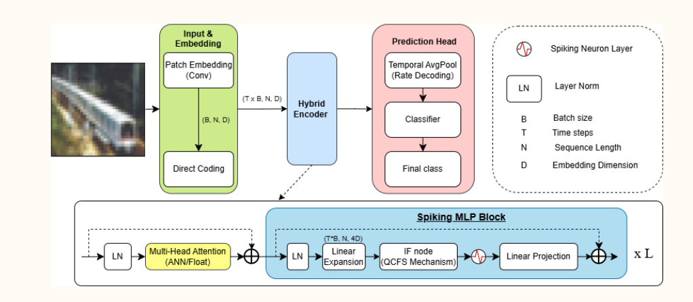

# ANN-to-SNN Conversion for Vision Transformers using QCFS 🧠⚡


## 📌 Introduction
This repository contains the official PyTorch implementation of the graduation thesis: **"ANN-to-SNN Conversion for Vision Transformers using Quantization Clip-Floor-Shift"**. 

Spiking Neural Networks (SNNs) offer a highly energy-efficient alternative to traditional Artificial Neural Networks (ANNs) by utilizing event-driven, binary spikes. This project provides a robust framework to convert Vision Transformer (ViT) architectures into SNNs, achieving near-lossless accuracy at ultra-low latency (Timesteps $T \le 4$).

**Key Highlights:**
* **Methodology:** Utilizes the **Quantization Clip-Floor-Shift (QCFS)** mechanism with trainable thresholds to jointly optimize clipping and quantization errors. (Note: This implementation relies solely on Cross-Entropy loss for end-to-end optimization, without requiring Knowledge Distillation).
* **Architectures:** Supports Tiny-ViT and Small-ViT.
* **Datasets:** CIFAR-10, CIFAR-100.
* **Performance:** Achieves competitive accuracy with significantly reduced inference energy consumption.

---



## 🚀 Features
- Complete pipeline for training ANN baseline models.
- Seamless conversion of ANN to SNN using the `SpikeVisionTransformer` and `Spiking MLP Block`.
- Energy and FLOPs calculation tools comparing MACs (ANN) vs. SOPs (SNN).
- Easy-to-use evaluation scripts with configurable quantization levels ($L$) and timesteps ($T$).

---

## 📊 Experimental Results

Our method demonstrates outstanding performance even at low timesteps ($T$). Below is a summary of the accuracy achieved on the CIFAR-10 and CIFAR-100 datasets using $L=4$.

| Dataset | Architecture | $T=2$ | $T=4$ | $T=8$ | $T=16$ | ANN Baseline |
| :--- | :--- | :--- | :--- | :--- | :--- | :--- |
| **CIFAR-10** | Tiny-ViT | 87.57% | 88.16% | 88.12% | **88.28%** | 88.34% |
| | Small-ViT | 84.71% | 85.18% | 85.41% | **85.44%** | 85.09% |
| **CIFAR-100**| Tiny-ViT | 60.83% | 62.47% | 62.71% | **62.93%** | 63.02% |
| | Small-ViT | 59.56% | 60.63% | **61.17%** | 61.08% | 61.10% |

*(For comprehensive energy consumption ratios and confusion matrices, please refer to the `results/` folder).*

---

## ⚙️ Installation

1. Clone the repository:
   ```bash
   git clone https://github.com/Phuoc2810/ViT-SNN-QCFS.git
   ```

2. Install the required dependencies:

    ```Bash
    pip install -r requirements.txt
    ```

## 💻 Usage (Kaggle / Colab Ready)

This repository is fully optimized for cloud notebook environments. You can run the entire pipeline from training to SNN evaluation by simply modifying the arguments in the execution scripts.

### Key Arguments Configuration
| Argument | Description | Default / Options |
| :--- | :--- | :--- |
| `--dataset` | Target dataset | `cifar10`, `cifar100` |
| `--checkpoint_path` | Path to load/save model weights | `checkpoints/test_model.pth` |
| `--T` | Number of timesteps for SNN simulation | `4` (Typical: 2, 4, 8, 16) |
| `--L` | Quantization levels for QCFS | `4` or `8` |
| `--pruning_ratio` | Sparsity amount for fine-tuning | `0.2` (20% sparsity) |
| `--batch_size` | Batch size for training/evaluation | `128` |
### Quick Start Pipeline

Copy and paste the following block into a single Kaggle/Colab cell to execute the full workflow:

```bash
# 1. Clone repository and setup environment
!git clone https://github.com/Phuoc2810/ViT-SNN-QCFS-KLTN.git
%cd ViT-SNN-QCFS-KLTN
!pip install -r requirements.txt

# 2. Train the ANN Baseline
!python scripts/train_ann.py \
    --dataset cifar10 \
    --batch_size 128 \
    --epochs 100

# 3. Fine-tune & Prune ANN (Optional for higher efficiency)
!python scripts/finetune.py \
    --checkpoint_path checkpoints/test_model.pth \
    --save_path checkpoints/ann_pruned.pth \
    --dataset cifar10 \
    --pruning_ratio 0.2 \
    --epochs 15 \
    --lr 1e-5

# 4. SNN Conversion & Evaluation
!python scripts/convert_snn.py \
    --checkpoint_path checkpoints/ann_pruned.pth \
    --dataset cifar10 \
    --T 4 \
    --L 4

# 5. Energy Analysis (MACs vs. SOPs)
!python scripts/calc_energy.py \
    --checkpoint_path checkpoints/ann_pruned.pth \
    --T 4
```

## 📁 Repository Structure
```text
VIT-QCFS-SNN-KLTN/
├──📂.gitignore
├──📂README.md            # Main project documentation
├──📂requirements.txt     # List of Python dependencies
├──📂checkpoints/
│   └──📜test_model.pth   # Sample pre-trained weights
│
├──📂data/                # Dataset directory
│   ├──📜cifar-10-python.tar.gz
│   │
│   └──📜cifar-10-batches-py
│
├──📂docs/
│   └──🖼️architecture.png  # Block diagram of the Hybrid Encoder
├──📂results
├──📂scripts/
│   ├──📜calc_energy.py    # Compares energy consumption
│   ├──📜convert_snn.py    # Evaluates the converted SNN use QCFS
│   ├──📜finetune.py       # Script for fine-tune convert SNN
│   └──📜train_ann.py      # Trains the baseline ANN-ViT
│ 
└──📂src/
    ├──📜config.py         # Global configurations and hyperparameters
    ├──📜dataset.py        # Data loading and preprocessing
    ├──📜layers.py         # Custom IF nodes, QCFS function layers
    ├──📜model_ann.py      # Baseline ViT architecture
    ├──📜model_snn.py      # Spike-ViT architecture definition
    ├──📜utils.py          # Helper functions
    └──📜__init__.py

```

# 🎓 Acknowledgements
This project was developed as a graduation thesis at the University of Information Technology (UIT), VNU-HCM.

If you find this repository helpful, please consider giving it a ⭐!